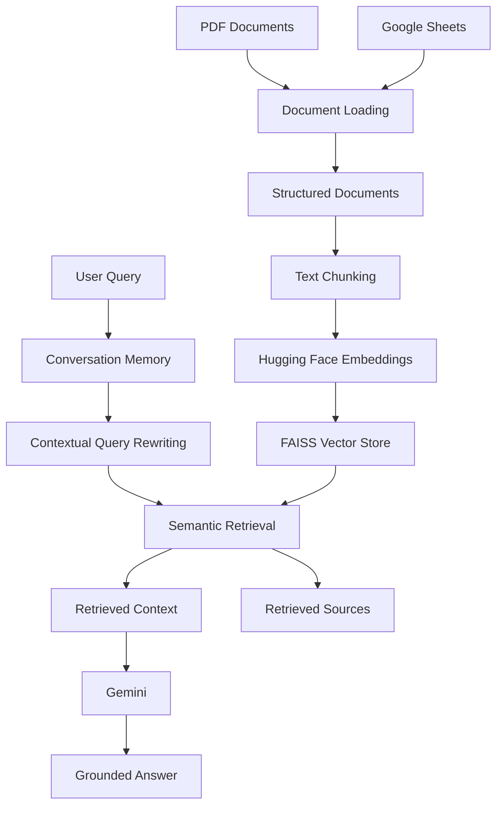

# 🧠 KnowFlow AI

### AI Knowledge Assistant with Conversational Memory

**KnowFlow AI** is an end-to-end **Retrieval-Augmented Generation (RAG)** application that transforms PDF documents and Google Sheets into a searchable knowledge base, retrieves relevant information using semantic similarity, and generates grounded answers with **Gemini**.

The system also supports **session-based conversational memory** and **context-aware query rewriting**, allowing users to ask natural follow-up questions without repeating the full context.

<p align="center">
  <a href="https://knowflowai.streamlit.app/">
    <strong>🚀 Live Demo</strong>
  </a>
  &nbsp;&nbsp;•&nbsp;&nbsp;
  <a href="https://github.com/AbdelrhmanAkl/KnowFlow-AI">
    <strong>💻 GitHub Repository</strong>
  </a>
</p>

---

## 📌 Overview

Traditional LLM applications can generate fluent answers, but they do not necessarily know the content of a user's private or project-specific knowledge base.

**KnowFlow AI** addresses this problem by introducing a retrieval layer between the user's question and the language model.

The system:

* Ingests knowledge from **PDF documents** and **Google Sheets**
* Converts heterogeneous sources into structured documents
* Splits documents into overlapping text chunks
* Generates semantic embeddings using Hugging Face
* Stores embeddings in a **FAISS** vector index
* Retrieves the most relevant knowledge using semantic similarity
* Uses conversation history to understand ambiguous follow-up questions
* Rewrites contextual queries before retrieval
* Generates grounded responses using **Gemini**
* Exposes retrieved source information for inspection
* Evaluates retrieval and generation separately

The project is intentionally focused on building a **modular AI Knowledge Assistant with conversational memory**, rather than an autonomous agent architecture.

---

# ✨ Key Features

| Feature               | Implementation                              |
| --------------------- | ------------------------------------------- |
| Knowledge Sources     | PDF + Google Sheets                         |
| Document Processing   | Structured documents + text chunking        |
| Embedding Model       | `sentence-transformers/all-MiniLM-L6-v2`    |
| Embedding Dimension   | 384                                         |
| Vector Store          | FAISS                                       |
| Retrieval Strategy    | Semantic similarity search                  |
| Default Retrieval     | Top 4 chunks                                |
| Language Model        | Gemini                                      |
| Conversational Memory | Session-based buffer memory                 |
| Follow-up Questions   | Context-aware query rewriting               |
| Grounding             | Retrieved-context-based generation          |
| Interface             | Streamlit                                   |
| Evaluation            | Retrieval + generation + grounding + memory |


---

# 🚀 Live Demo

### Try KnowFlow AI

**Live Application:**
https://knowflowai.streamlit.app/

The deployed application allows users to:

* Ask questions about the indexed knowledge base
* Retrieve semantically relevant information
* Inspect retrieved sources
* Ask conversational follow-up questions
* Observe context-aware retrieval behavior

---

# 🏗️ System Architecture

KnowFlow AI is organized as a modular RAG pipeline where ingestion, indexing, retrieval, conversational context, and generation are handled as separate stages.



---

# 🔄 End-to-End RAG Workflow

```text
PDF / Google Sheets
        │
        ▼
Document Loading
        │
        ▼
Structured Documents
        │
        ▼
Text Chunking
        │
        ▼
Hugging Face Embeddings
        │
        ▼
FAISS Vector Store
        │
        ▼
User Query
        │
        ▼
Conversation Memory
        │
        ▼
Contextual Query Rewriting
        │
        ▼
Semantic Retrieval
        │
        ▼
Retrieved Context
        │
        ▼
Gemini
        │
        ▼
Grounded Answer
        │
        ▼
Retrieved Sources
```

---

# 📚 Knowledge Ingestion

KnowFlow AI combines structured and unstructured knowledge sources into a single searchable knowledge base.

## 📄 PDF Knowledge Source

The main unstructured source is the:

**World Bank Group Annual Report 2025**

| Property | Value                         |
| -------- | ----------------------------- |
| Format   | PDF                           |
| Pages    | 67                            |
| Size     | Approximately 11.2 MB         |
| Role     | Unstructured knowledge source |

The document is loaded page-by-page while preserving page-level metadata for source inspection and retrieval traceability.

---

## 📊 Google Sheets Knowledge Base

The structured knowledge source contains:

**55 knowledge entries**

The dataset includes:

```text
ID
Category
Topic
Question
Answer
Source
Tags
```

Using both PDF and spreadsheet data demonstrates how different knowledge formats can be normalized into a unified retrieval pipeline.

---

# ✂️ Document Processing

After ingestion, source content is converted into structured documents and divided into overlapping chunks.

### Chunking Configuration

```text
chunk_size    = 1000
chunk_overlap = 150
```

The final knowledge base contains:

```text
373 indexed chunks
```

The overlap helps preserve contextual continuity when relevant information spans chunk boundaries.

---

# 🧠 Semantic Embeddings

KnowFlow AI uses the Hugging Face Sentence Transformers model:

```text
sentence-transformers/all-MiniLM-L6-v2
```

### Embedding Configuration

| Property      | Value                                    |
| ------------- | ---------------------------------------- |
| Model         | `sentence-transformers/all-MiniLM-L6-v2` |
| Dimension     | 384                                      |
| Normalization | Enabled                                  |
| Device        | CPU                                      |

Each knowledge chunk is transformed into a numerical vector representation that captures semantic relationships between text passages.

These vectors are then used for similarity-based retrieval.

---

# 🔎 FAISS Retrieval

The generated embeddings are stored in a **FAISS** vector index.

FAISS provides the similarity-search layer responsible for identifying knowledge chunks that are semantically relevant to the user's query.

### Retrieval Configuration

```text
top_k = 4
```

The system retrieves up to four relevant chunks before constructing the context supplied to Gemini.

---

# 💬 Conversational Memory

KnowFlow AI supports **session-based buffer-style conversational memory**.

Instead of processing every question independently, the application maintains conversation history within the current session.

This allows users to ask follow-up questions such as:

```text
User:
What is buffer-style conversational memory?

User:
What does it keep?
```

The second question is ambiguous when considered independently.

The system uses the conversation history to produce a more self-contained retrieval query:

```text
What does buffer-style conversational memory keep
```

The rewritten query is then passed through the standard semantic retrieval pipeline.

### This enables:

* Conversation history
* Context-aware retrieval
* Follow-up question handling
* Query rewriting
* More natural multi-turn interactions

---

# 🔄 Contextual Query Rewriting

One of the challenges in conversational RAG is handling short or ambiguous follow-up questions.

For example:

```text
What is buffer-style memory?

What does it keep?
```

The second question does not explicitly identify what **"it"** refers to.

KnowFlow AI addresses this by incorporating recent conversation history before performing semantic retrieval.

### Query Rewriting Flow

```text
Conversation History
        │
        ▼
Current User Question
        │
        ▼
Contextual Query Rewriting
        │
        ▼
Self-Contained Retrieval Query
        │
        ▼
Semantic Retrieval
        │
        ▼
Relevant Knowledge
```

The underlying knowledge base does not need to change. Only the retrieval query is made more explicit.

---

# 🎯 Grounded Generation

After retrieval, the selected knowledge chunks are assembled into a context that is provided to Gemini.

```text
User Question
      │
      ▼
Semantic Retrieval
      │
      ▼
Relevant Chunks
      │
      ▼
Context Construction
      │
      ▼
Gemini
      │
      ▼
Grounded Answer
```

The generation layer is instructed to answer using the retrieved knowledge context rather than relying on unrelated outside information.

When the requested information is not supported by the available knowledge, the system can indicate that the information was not found in the provided knowledge base.

> **Important:** Grounding does not guarantee that hallucinations are completely eliminated. It means that the generation process is constrained by retrieved knowledge rather than intentionally relying on unrelated external knowledge.

---

# 📦 Knowledge Base Summary

| Component           | Configuration                            |
| ------------------- | ---------------------------------------- |
| Embedding Model     | `sentence-transformers/all-MiniLM-L6-v2` |
| Embedding Dimension | 384                                      |
| Chunk Size          | 1000                                     |
| Chunk Overlap       | 150                                      |
| Indexed Chunks      | 373                                      |
| Default Top-K       | 4                                        |
| Vector Store        | FAISS                                    |

---

# 🧪 Evaluation Strategy

KnowFlow AI evaluates different components of the RAG pipeline independently.

The evaluation covers:

1. **Retrieval**
2. **Generation**
3. **Grounding behavior**
4. **Conversational memory**

This separation is important because retrieval quality and generation success measure different aspects of a RAG system.

The project therefore avoids presenting a single misleading **"overall accuracy"** number.

---

# 📊 Retrieval Evaluation

The retrieval evaluation contains:

```text
20 evaluation questions
```

## Results

| Metric               |             Result |
| -------------------- | -----------------: |
| Expected Topic Hit@1 |  **16 / 20 — 80%** |
| Expected Topic Hit@4 | **20 / 20 — 100%** |

### Hit@1

Measures whether the expected topic was the top retrieved result.

```text
16 / 20 = 80%
```

### Hit@4

Measures whether the expected topic appeared within the top four retrieved results.

```text
20 / 20 = 100%
```

> These are **retrieval metrics**, not answer-accuracy metrics. They should not be interpreted as the percentage of questions answered correctly.

---

# 🤖 Generation Evaluation

Generation was evaluated independently from retrieval.

The evaluation included:

```text
20 test questions
```

## Results

| Metric                  |      Result |
| ----------------------- | ----------: |
| Successful Generations  | **20 / 20** |
| Generation Success Rate |    **100%** |
| Generation Failures     |       **0** |

### What Does Generation Success Mean?

The Generation Success Rate measures whether the system successfully produced a response.

It does **not** measure:

* Answer accuracy
* Factual correctness
* Retrieval quality
* Hallucination rate

During the original evaluation run, one temporary model-availability `503` error occurred. The affected case was successfully retried.

The final evaluation result was:

```text
20 / 20 successful generations
```

---

# 🛡️ Grounding Tests

The application was also tested with questions that fall outside the indexed knowledge base.

## Test 1

```text
What is the population of Mars?
```

The system indicated that the requested information was not found in the provided documents rather than producing an unrelated answer.

## Test 2

```text
What is the capital of Japan?
```

The system similarly indicated that the requested information was not available in the provided knowledge.

These tests demonstrate the intended **grounding behavior** of the system.

> The project does not claim that hallucinations are completely eliminated. The goal is to reduce unsupported responses by constraining generation around retrieved knowledge.

---

# 🧩 RAG Example

A tested example using the World Bank knowledge source:

```text
What financing was announced for Egypt power projects?
```

The system retrieved the relevant section from:

```text
World Bank Group Annual Report 2025
Page 20
```

The resulting grounded answer identified a:

```text
$1.1 billion financing package
```

### Retrieval-to-Generation Flow

```text
Question
   │
   ▼
Semantic Retrieval
   │
   ▼
Relevant World Bank Content
   │
   ▼
Grounded Context
   │
   ▼
Gemini
   │
   ▼
Answer + Retrieved Source
```

This example demonstrates the complete RAG workflow from user question to retrieved evidence and generated response.

---

# 🧠 Conversational Memory Example

The conversational memory workflow was tested using:

```text
User:
What is buffer-style conversational memory?
```

Follow-up:

```text
What does it keep?
```

The system used conversation history to rewrite the follow-up query as:

```text
What does buffer-style conversational memory keep
```

The rewritten query successfully retrieved relevant knowledge.

This demonstrates the interaction between:

```text
Conversation Memory
        +
Query Rewriting
        +
Semantic Retrieval
```

---

# 🛠️ Technology Stack

| Technology                         | Purpose                    |
| ---------------------------------- | -------------------------- |
| Python                             | Core application language  |
| Streamlit                          | Web application interface  |
| LangChain                          | RAG application components |
| LangChain Community                | Community integrations     |
| LangChain Hugging Face             | Embedding integration      |
| LangChain Text Splitters           | Document chunking          |
| FAISS                              | Vector similarity search   |
| Hugging Face Sentence Transformers | Semantic embeddings        |
| `all-MiniLM-L6-v2`                 | Embedding model            |
| Gemini                             | Answer generation          |
| Google GenAI                       | Gemini integration         |
| PyMuPDF                            | PDF processing             |
| Pandas                             | Structured data processing |
| OpenPyXL                           | Spreadsheet processing     |
| python-dotenv                      | Environment configuration  |

---

# 📁 Project Structure

```text
KnowFlow-AI/
│
├── app.py
├── requirements.txt
├── README.md
├── .gitignore
│
├── assets/
│   └── knowflow-ai-preview.png
│
├── data/
│   ├── knowledge_base/
│   │   ├── index.faiss
│   │   └── index.pkl
│   │
│   └── world_bank_group_annual_report_2025.pdf
│
├── evaluation/
│   ├── evaluate.py
│   ├── evaluate_generation.py
│   ├── generation_results.json
│   ├── results.json
│   └── test_questions.json
│
└── src/
    │
    ├── embeddings/
    │   └── embedding_pipeline.py
    │
    ├── generation/
    │   └── llm.py
    │
    ├── ingestion/
    │   ├── loader.py
    │   ├── pdf_loader.py
    │   ├── sheets_loader.py
    │   └── text_splitter.py
    │
    ├── memory/
    │   └── conversation_memory.py
    │
    ├── retrieval/
    │   ├── query_rewriter.py
    │   ├── retriever.py
    │   └── vector_store.py
    │
    ├── knowledge_base.py
    └── pipeline.py
```

---

# ⚙️ Local Setup

## 1. Clone the Repository

```bash
git clone https://github.com/AbdelrhmanAkl/KnowFlow-AI.git
cd KnowFlow-AI
```

---

## 2. Create a Virtual Environment

### Windows

```bash
python -m venv venv
venv\Scripts\activate
```

### macOS / Linux

```bash
python3 -m venv venv
source venv/bin/activate
```

---

## 3. Install Dependencies

```bash
pip install -r requirements.txt
```

---

## 4. Configure Environment Variables

Create a `.env` file in the project root:

```env
GEMINI_API_KEY=your_gemini_api_key
```

> **Security:** Never commit API keys, credentials, or other secrets to GitHub.

---

# ▶️ Run the Application

Start the Streamlit application:

```bash
python -m streamlit run app.py
```

The application will launch locally and provide the KnowFlow AI interface.

---

# 🧭 How to Use

### 1. Ask a Question

Enter a question related to the indexed knowledge.

### 2. Contextual Query Rewriting

If the question is a follow-up, conversation history can be used to make the query more self-contained.

### 3. Semantic Retrieval

The rewritten query is compared against the FAISS vector index.

### 4. Context Construction

The most relevant chunks are assembled into the context supplied to Gemini.

### 5. Answer Generation

Gemini generates a response using the retrieved context.

### 6. Source Inspection

Retrieved source information can be inspected alongside the generated answer.

### 7. Continue the Conversation

Users can continue asking follow-up questions while the current session maintains conversational context.

---

# 🏛️ Engineering Decisions

## Why RAG?

A general-purpose LLM can generate answers from its pretrained knowledge, but that does not guarantee that its response is based on the project's specific documents.

RAG introduces an explicit retrieval stage:

```text
Knowledge Base
      ↓
Semantic Retrieval
      ↓
Relevant Context
      ↓
LLM
      ↓
Grounded Response
```

This provides a controlled mechanism for connecting generation to project-specific knowledge.

---

## Why FAISS?

FAISS provides a lightweight local vector indexing and similarity-search solution.

For this portfolio project, it offers a practical balance between:

* Simplicity
* Performance
* Local reproducibility
* Easy integration with the RAG pipeline

---

## Why `all-MiniLM-L6-v2`?

The project uses:

```text
sentence-transformers/all-MiniLM-L6-v2
```

with 384-dimensional embeddings.

The model provides a compact semantic representation suitable for the project's retrieval workload while keeping the embedding pipeline relatively lightweight.

---

## Why Query Rewriting?

Conversational questions are often incomplete when processed independently.

For example:

```text
What is buffer-style memory?

What does it keep?
```

The second question depends on the previous conversation.

Query rewriting resolves this dependency by incorporating conversational context before semantic retrieval.

---

## Why Session-Based Memory?

The project focuses on conversational context within the current application session.

A lightweight buffer-based approach is sufficient to demonstrate:

* Conversation history
* Follow-up understanding
* Context-aware query rewriting

without introducing unnecessary persistent-memory infrastructure.

---

## Why Separate Retrieval and Generation Evaluation?

Retrieval and generation measure different parts of a RAG system.

For example:

* A system may retrieve relevant information but generate a poor response.
* A system may successfully generate text despite weak retrieval.
* A system may retrieve relevant context and generate a grounded response.

Therefore, KnowFlow AI reports retrieval and generation results separately instead of combining them into a single unsupported accuracy metric.

---

# 📈 Evaluation Summary

| Evaluation Area         |      Result |
| ----------------------- | ----------: |
| Evaluation Questions    |      **20** |
| Expected Topic Hit@1    |     **80%** |
| Expected Topic Hit@4    |    **100%** |
| Successful Generations  | **20 / 20** |
| Generation Success Rate |    **100%** |
| Generation Failures     |       **0** |

> These results describe the tested behavior of the implemented system. They should **not** be interpreted as general-purpose answer accuracy.

---

# ⚠️ Limitations

KnowFlow AI is intentionally a focused RAG implementation and has several limitations.

### Knowledge Scope

The assistant can provide grounded answers only from the knowledge indexed into its current knowledge base.

### Session-Based Memory

Conversation history is maintained within the current application session rather than through persistent long-term memory.

### Retrieval Quality

The current retrieval evaluation achieved:

```text
Hit@1 = 80%
Hit@4 = 100%
```

However, retrieval quality can still vary depending on query wording, ambiguity, and complexity.

### Generation Quality

A successful generation only confirms that the model produced a response.

It does not guarantee factual correctness or answer quality.

### Grounding

The system is designed to reduce unsupported responses, but grounding does not guarantee the complete elimination of hallucinations.

### Knowledge Base Updates

Changes to the underlying knowledge sources require the vector knowledge base to be updated and re-indexed.

---

# 🔮 Future Improvements

Potential future improvements include:

* Retrieval reranking
* Hybrid lexical + semantic retrieval
* More comprehensive retrieval benchmarks
* Improved chunking strategies
* Citation-level answer evaluation
* More rigorous answer-quality evaluation
* Persistent conversation storage
* Better handling of long conversation histories
* Additional document formats
* Automated knowledge-base update workflows
* Retrieval observability and monitoring
* Production-oriented evaluation and monitoring

These are **future directions**, not components of the current implementation.

---

# 🎯 What This Project Demonstrates

KnowFlow AI demonstrates practical experience across the complete RAG application lifecycle:

```text
Data Ingestion
      ↓
Document Processing
      ↓
Text Chunking
      ↓
Embedding Generation
      ↓
Vector Indexing
      ↓
Semantic Retrieval
      ↓
Conversational Query Rewriting
      ↓
Context Construction
      ↓
LLM Generation
      ↓
Grounded Response
      ↓
Source Inspection
      ↓
Evaluation
```

Rather than simply connecting an LLM to a chat interface, the project demonstrates how to build, structure, evaluate, and deploy a complete knowledge-grounded AI application.

---

# 🔗 Project Links

### GitHub Repository

https://github.com/AbdelrhmanAkl/KnowFlow-AI

### Live Application

https://knowflowai.streamlit.app/

---

# 👨‍💻 Author

## Abdelrahman Akl

**AI / Machine Learning Engineer**

Interested in:

* Artificial Intelligence
* Machine Learning
* Natural Language Processing
* Generative AI
* Retrieval-Augmented Generation
* AI Application Development

### Connect

* GitHub: https://github.com/AbdelrhmanAkl
* Project: https://github.com/AbdelrhmanAkl/KnowFlow-AI
* Live Demo: https://knowflowai.streamlit.app/

---

# ⭐ Final Note

**KnowFlow AI** was developed as a practical AI engineering portfolio project demonstrating how a knowledge-grounded assistant can be built from raw knowledge sources through document processing, semantic retrieval, conversational context, LLM generation, and system evaluation.

The project emphasizes:

* **Modular RAG architecture**
* **Semantic knowledge retrieval**
* **Conversational query rewriting**
* **Grounded response generation**
* **Retrieved-source inspection**
* **Separate component-level evaluation**
* **Transparent reporting of system limitations**

The objective is to demonstrate practical AI engineering capabilities while avoiding unsupported claims about accuracy, scale, or production performance.
