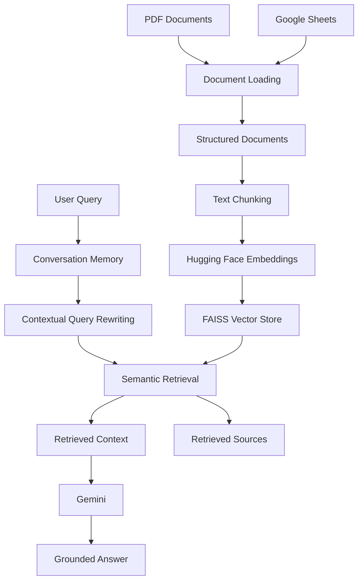

# 🧠 KnowFlow AI

### Basic AI Knowledge Assistant with Conversational Memory

**KnowFlow AI** is an end-to-end **Retrieval-Augmented Generation (RAG)** application that transforms PDF documents and Google Sheets into a searchable knowledge base, retrieves relevant information using semantic similarity, and generates grounded answers with **Gemini** while maintaining conversational context within the current session.

<p align="center">
  <a href="https://knowflowai.streamlit.app/">
    <strong>🚀 Live Demo</strong>
  </a>
  &nbsp;&nbsp;•&nbsp;&nbsp;
  <a href="https://github.com/AbdelrhmanAkl/KnowFlow-AI">
    <strong>💻 GitHub Repository</strong>
  </a>
</p>

---

## 📌 Overview

Modern knowledge assistants become more useful when they can connect user questions to reliable source material while maintaining context across a conversation.

**KnowFlow AI** demonstrates this workflow through a modular RAG architecture that combines:

* 📄 PDF document ingestion
* 📊 Google Sheets knowledge ingestion
* ✂️ Structured document processing and text chunking
* 🧠 Semantic embeddings using Hugging Face
* 🔎 FAISS vector similarity search
* 💬 Session-based conversational memory
* 🔄 Context-aware query rewriting
* 🤖 Grounded response generation with Gemini
* 📚 Retrieved source inspection
* 🧪 Separate retrieval and generation evaluation

The project is intentionally designed as a **focused AI Knowledge Assistant with conversational memory**, rather than an autonomous agent system.

---

## ✨ Key Features

| Capability            | Implementation                                    |
| --------------------- | ------------------------------------------------- |
| Knowledge Ingestion   | PDF + Google Sheets                               |
| Document Processing   | Structured documents + text chunking              |
| Embeddings            | `sentence-transformers/all-MiniLM-L6-v2`          |
| Embedding Dimension   | 384                                               |
| Vector Store          | FAISS                                             |
| Retrieval             | Semantic similarity search                        |
| Default Top-K         | 4                                                 |
| LLM                   | Gemini                                            |
| Conversational Memory | Session-based buffer memory                       |
| Follow-up Handling    | Context-aware query rewriting                     |
| Grounding             | Generation constrained by retrieved context       |
| Interface             | Streamlit                                         |
| Evaluation            | Retrieval + generation + grounding + memory tests |

---

# 🖥️ Interface Preview

<p align="center">
  
</p>

> Add the final Streamlit screenshot to `assets/knowflow-ai-preview.png` to display the interface preview.

---

# 🚀 Live Demo

### Try KnowFlow AI

**Live Application:**
https://knowflowai.streamlit.app/

The deployed application provides the Streamlit interface for:

* Asking questions about the indexed knowledge base
* Inspecting retrieved sources
* Testing conversational follow-up questions
* Observing context-aware retrieval behavior

---

# 🏗️ Architecture

KnowFlow AI follows a modular RAG pipeline that separates:

1. Knowledge ingestion
2. Document processing
3. Embedding generation
4. Vector indexing
5. Conversational context
6. Query rewriting
7. Semantic retrieval
8. Context construction
9. LLM generation
10. Source inspection



---

# 🔄 End-to-End Workflow

```text
PDF / Google Sheets
        ↓
Document Loading
        ↓
Structured Documents
        ↓
Text Chunking
        ↓
Hugging Face Embeddings
        ↓
FAISS Vector Store
        ↓
User Query
        ↓
Conversation Memory
        ↓
Contextual Query Rewriting
        ↓
Semantic Retrieval
        ↓
Retrieved Context
        ↓
Gemini
        ↓
Grounded Answer
        ↓
Retrieved Sources
```

---

# 📚 RAG Pipeline

KnowFlow AI separates the **knowledge retrieval process** from the **answer generation process**.

## 1. Data Ingestion

The knowledge base combines two complementary source formats.

### 📄 PDF Knowledge Source

The main unstructured knowledge source is the:

**World Bank Group Annual Report 2025**

| Property | Value                         |
| -------- | ----------------------------- |
| Format   | PDF                           |
| Pages    | 67                            |
| Size     | Approximately 11.2 MB         |
| Role     | Unstructured knowledge source |

The PDF is loaded page-by-page while preserving page-level metadata for source inspection.

### 📊 Google Sheets Knowledge Base

The structured knowledge source contains:

**55 knowledge entries**

The dataset includes:

```text
ID
Category
Topic
Question
Answer
Source
Tags
```

Combining these sources demonstrates how both structured and unstructured information can be incorporated into a unified retrieval system.

---

# ✂️ 2. Document Processing

After ingestion, source content is converted into structured documents and divided into smaller overlapping chunks.

### Current Configuration

```text
chunk_size    = 1000
chunk_overlap = 150
```

The final knowledge base contains:

```text
373 indexed chunks
```

Chunk overlap helps preserve contextual continuity when relevant information spans chunk boundaries.

---

# 🧠 3. Embeddings

KnowFlow AI uses the Hugging Face Sentence Transformers model:

```text
sentence-transformers/all-MiniLM-L6-v2
```

### Configuration

| Property            | Value                                    |
| ------------------- | ---------------------------------------- |
| Model               | `sentence-transformers/all-MiniLM-L6-v2` |
| Embedding Dimension | 384                                      |
| Normalization       | Enabled                                  |
| Device              | CPU                                      |

Each knowledge chunk is converted into a numerical vector representation that captures semantic information for similarity-based retrieval.

---

# 🔎 4. FAISS Vector Store

The generated embeddings are indexed using **FAISS**.

FAISS provides the vector similarity-search layer used to identify knowledge chunks that are semantically relevant to a user's query.

### Retrieval Configuration

```text
top_k = 4
```

The system retrieves up to four relevant chunks before constructing the context supplied to Gemini.

---

# 💬 Conversational Memory

KnowFlow AI includes **session-based buffer-style conversational memory**.

Instead of treating every question as completely independent, the application maintains conversation history during the current session.

This enables follow-up questions such as:

```text
User:
What is buffer-style conversational memory?

User:
What does it keep?
```

The second question is ambiguous when considered independently.

KnowFlow AI uses the conversation history to rewrite the follow-up into a more self-contained retrieval query, such as:

```text
What does buffer-style conversational memory keep
```

The rewritten query is then passed through the normal semantic retrieval pipeline.

This demonstrates the interaction between:

* Conversation memory
* Context-aware retrieval
* Query rewriting
* Follow-up question handling

---

# 🔄 Query Rewriting

Conversational RAG systems frequently encounter short follow-up questions that lack sufficient context when processed independently.

For example:

```text
What is buffer-style memory?

What does it keep?
```

The second question does not explicitly identify what "it" refers to.

KnowFlow AI addresses this by using recent conversation history to produce a clearer retrieval query before semantic search.

### Query Rewriting Flow

```text
Conversation History
        ↓
Current User Question
        ↓
Contextual Query Rewriting
        ↓
Semantic Retrieval
        ↓
Relevant Knowledge
```

Query rewriting improves retrieval for ambiguous conversational follow-ups without changing the underlying knowledge base.

---

# 🎯 Grounded Generation

After retrieving relevant chunks, KnowFlow AI constructs a context and passes it to Gemini.

The generation flow is:

```text
User Query
    ↓
Retrieve Relevant Chunks
    ↓
Build Context
    ↓
Gemini
    ↓
Grounded Answer
```

The generation layer is instructed to answer using the provided document context rather than relying on unrelated outside knowledge.

When the requested information is not supported by the retrieved knowledge, the system can indicate that the information was not found in the provided knowledge base.

This approach is designed to **reduce unsupported responses**.

> **Important:** Grounding does not guarantee that hallucinations are completely eliminated. It means that the generation process is constrained by the retrieved knowledge context.

---

# 📦 Knowledge Base

The final FAISS knowledge base contains:

```text
373 indexed chunks
```

### Retrieval Configuration

```text
Embedding Model:
sentence-transformers/all-MiniLM-L6-v2

Embedding Dimension:
384

Chunk Size:
1000

Chunk Overlap:
150

Default Top-K:
4
```

---

# 🧪 Evaluation

KnowFlow AI evaluates different components of the RAG pipeline separately:

1. Retrieval
2. Generation
3. Grounding behavior
4. Conversational memory

This separation avoids presenting a single misleading "accuracy" number for a system whose components measure different behaviors.

---

# 📊 Retrieval Evaluation

The retrieval evaluation contains:

```text
20 evaluation questions
```

### Results

| Metric               |             Result |
| -------------------- | -----------------: |
| Expected Topic Hit@1 |  **16 / 20 — 80%** |
| Expected Topic Hit@4 | **20 / 20 — 100%** |

### Understanding the Metrics

#### Hit@1

Measures whether the expected topic was the top retrieved topic.

```text
16 / 20 = 80%
```

#### Hit@4

Measures whether the expected topic appeared within the top four retrieved results.

```text
20 / 20 = 100%
```

> These are **retrieval metrics**, not answer-accuracy metrics. They should not be interpreted as the percentage of questions answered correctly.

---

# 🤖 Generation Evaluation

Generation was evaluated separately from retrieval.

The evaluation included:

```text
20 test questions
```

### Results

| Metric                  |      Result |
| ----------------------- | ----------: |
| Successful Generations  | **20 / 20** |
| Generation Success Rate |    **100%** |
| Generation Failures     |       **0** |

### Important Interpretation

The **Generation Success Rate** measures whether the system successfully generated a response.

It does **not** measure:

* Answer accuracy
* Factual correctness
* Retrieval quality
* Hallucination rate

There was one temporary model-availability `503` failure during the original evaluation run. The affected case was successfully retried, resulting in the final:

```text
20 / 20 successful generations
```

---

# 🛡️ Grounding Tests

The system was explicitly tested with questions outside the provided knowledge base.

### Unsupported Question 1

```text
What is the population of Mars?
```

The system responded that the information was not found in the provided documents rather than generating an unrelated answer.

### Unsupported Question 2

```text
What is the capital of Japan?
```

The system also indicated that the requested information was not found in the provided documents.

These tests demonstrate the intended **grounding behavior** of the application.

> The project does not claim to completely eliminate hallucinations. Instead, the generation layer is designed to answer from retrieved context and reduce unsupported responses.

---

# 🧩 RAG Example

A tested example using the World Bank knowledge source:

```text
What financing was announced for Egypt power projects?
```

The system retrieved the relevant section from:

```text
World Bank Group Annual Report 2025
Page 20
```

The generated grounded answer identified a:

```text
$1.1 billion financing package
```

### Complete RAG Flow

```text
Question
   ↓
Semantic Retrieval
   ↓
Relevant World Bank Content
   ↓
Grounded Context
   ↓
Gemini
   ↓
Answer + Retrieved Source
```

This example demonstrates the complete retrieval-to-generation workflow.

---

# 🧠 Conversational Memory Example

A tested conversational example:

```text
User:

What is buffer-style conversational memory?
```

Follow-up:

```text
What does it keep?
```

The system used conversation history to rewrite the follow-up query:

```text
What does buffer-style conversational memory keep
```

The rewritten query successfully retrieved relevant knowledge.

This verifies the interaction between:

```text
Conversation Memory
        +
Query Rewriting
        +
Semantic Retrieval
```

---

# 🛠️ Tech Stack

| Technology                         | Purpose                    |
| ---------------------------------- | -------------------------- |
| Python                             | Core application language  |
| Streamlit                          | Web application interface  |
| LangChain                          | RAG application components |
| LangChain Community                | Community integrations     |
| LangChain Hugging Face             | Hugging Face integration   |
| LangChain Text Splitters           | Document chunking          |
| FAISS                              | Vector similarity search   |
| Hugging Face Sentence Transformers | Text embeddings            |
| `all-MiniLM-L6-v2`                 | Embedding model            |
| Gemini                             | Answer generation          |
| Google GenAI                       | Gemini integration         |
| PyMuPDF                            | PDF processing             |
| Pandas                             | Structured data processing |
| OpenPyXL                           | Spreadsheet processing     |
| python-dotenv                      | Environment configuration  |

---

# 📁 Project Structure

```text
KnowFlow-AI/
│
├── app.py
├── requirements.txt
├── README.md
├── .gitignore
│
├── assets/
│   └── knowflow-ai-preview.png
│
├── data/
│   ├── knowledge_base/
│   │   ├── index.faiss
│   │   └── index.pkl
│   │
│   └── world_bank_group_annual_report_2025.pdf
│
├── evaluation/
│   ├── evaluate.py
│   ├── evaluate_generation.py
│   ├── generation_results.json
│   ├── results.json
│   └── test_questions.json
│
└── src/
    │
    ├── embeddings/
    │   └── embedding_pipeline.py
    │
    ├── generation/
    │   └── llm.py
    │
    ├── ingestion/
    │   ├── loader.py
    │   ├── pdf_loader.py
    │   ├── sheets_loader.py
    │   └── text_splitter.py
    │
    ├── memory/
    │   └── conversation_memory.py
    │
    ├── retrieval/
    │   ├── query_rewriter.py
    │   ├── retriever.py
    │   └── vector_store.py
    │
    ├── knowledge_base.py
    └── pipeline.py
```

---

# ⚙️ Local Setup

## 1. Clone the Repository

```bash
git clone https://github.com/AbdelrhmanAkl/KnowFlow-AI.git

cd KnowFlow-AI
```

---

## 2. Create a Virtual Environment

### Windows

```bash
python -m venv venv

venv\Scripts\activate
```

### macOS / Linux

```bash
python3 -m venv venv

source venv/bin/activate
```

---

## 3. Install Dependencies

```bash
pip install -r requirements.txt
```

---

## 4. Configure Environment Variables

Create a `.env` file in the project root:

```env
GEMINI_API_KEY=your_gemini_api_key
```

> Never commit API keys, credentials, or other secrets to GitHub.

---

# ▶️ Running the Application

Start the Streamlit application:

```bash
python -m streamlit run app.py
```

The application will start locally and provide the Streamlit interface for querying the indexed knowledge base.

---

# 🧭 Usage

The application workflow is straightforward:

### Step 1 — Ask a Question

Enter a question related to the indexed knowledge.

### Step 2 — Contextual Query Rewriting

If the question is a conversational follow-up, recent session history can be used to rewrite it into a more self-contained retrieval query.

### Step 3 — Semantic Retrieval

KnowFlow AI searches the FAISS vector store for semantically relevant chunks.

### Step 4 — Context Construction

The retrieved content is assembled into the context supplied to Gemini.

### Step 5 — Answer Generation

Gemini generates an answer based on the retrieved context.

### Step 6 — Source Inspection

Retrieved source information is exposed so users can inspect the supporting knowledge.

### Step 7 — Continue the Conversation

Follow-up questions can use the existing conversation context through session memory and query rewriting.

---

# 🏛️ Engineering Decisions

## Why RAG?

A conventional LLM can generate answers from its general training knowledge, but that does not guarantee that the answer is based on the user's specific documents.

RAG introduces an explicit retrieval stage:

```text
Knowledge Base
      ↓
Retrieval
      ↓
Relevant Context
      ↓
LLM
```

This allows the application to ground generation in the project's own knowledge sources.

---

## Why FAISS?

FAISS provides a lightweight local vector indexing and similarity-search layer for the embedding-based retrieval workflow.

It keeps the architecture relatively simple while providing an effective foundation for semantic search.

---

## Why `all-MiniLM-L6-v2`?

The project uses:

```text
sentence-transformers/all-MiniLM-L6-v2
```

with:

```text
384-dimensional embeddings
```

The model provides a compact semantic representation suitable for the project's retrieval workload.

---

## Why Query Rewriting?

Conversational questions are often incomplete when considered independently.

For example:

```text
What is buffer-style memory?

What does it keep?
```

Query rewriting resolves this dependency by incorporating conversation context before retrieval.

---

## Why Session-Based Memory?

The project focuses on conversational context within the current assistant session.

A lightweight buffer-style implementation is sufficient to demonstrate:

* Conversation history
* Follow-up understanding
* Context-aware query rewriting

without introducing unnecessary persistent-memory infrastructure.

---

## Why Separate Retrieval and Generation Evaluation?

Retrieval quality and generation success measure different components of a RAG system.

A system can:

* Retrieve relevant information but generate a poor response.
* Generate a response successfully while retrieving weak context.
* Retrieve relevant context and successfully generate a grounded answer.

For that reason, KnowFlow AI reports retrieval and generation results separately rather than presenting a misleading single "answer accuracy" metric.

---

# 📈 Current Evaluation Summary

```text
Evaluation Questions
        20

Expected Topic Hit@1
        80%

Expected Topic Hit@4
        100%

Successful Generations
        20 / 20

Generation Success Rate
        100%

Generation Failures
        0
```

These numbers describe the tested retrieval and generation behavior of the implemented system.

> They should **not** be interpreted as general-purpose answer accuracy.

---

# ⚠️ Limitations

KnowFlow AI is intentionally a focused RAG implementation and has several limitations.

### Knowledge Scope

The assistant can provide grounded answers only from the knowledge indexed into its current knowledge base.

### Session-Based Memory

Conversational memory is maintained within the application session rather than through persistent long-term user memory.

### Retrieval Quality

Although the current evaluation achieved:

```text
Hit@1 = 80%
Hit@4 = 100%
```

retrieval quality can still vary depending on query wording, ambiguity, and complexity.

### Generation Quality

A successful generation does not necessarily mean the generated answer is factually correct.

The current evaluation therefore does not claim a general answer-accuracy percentage.

### Grounding

The system is designed to reduce unsupported answers, but no claim is made that hallucinations are completely eliminated.

### Knowledge Base Updates

Changes to the underlying knowledge sources require the knowledge base to be updated and indexed accordingly.

---

# 🔮 Future Improvements

Potential future improvements include:

* Advanced retrieval evaluation datasets
* Retrieval reranking
* Improved chunking strategies
* Hybrid lexical + semantic retrieval
* More comprehensive answer-quality evaluation
* Citation-level answer evaluation
* Persistent conversation storage
* Better handling of long conversational histories
* Additional document formats
* More advanced knowledge-base update workflows
* Retrieval observability and monitoring

These represent future directions rather than components of the current architecture.

---

# 🎯 What This Project Demonstrates

KnowFlow AI demonstrates an end-to-end understanding of modern RAG application development:

```text
Data Ingestion
      ↓
Document Processing
      ↓
Text Chunking
      ↓
Embedding Generation
      ↓
Vector Indexing
      ↓
Semantic Retrieval
      ↓
Conversational Query Rewriting
      ↓
Context Construction
      ↓
LLM Generation
      ↓
Grounded Response
      ↓
Source Inspection
      ↓
Evaluation
```

The project focuses on building and evaluating a complete RAG workflow rather than simply connecting an LLM to a chat interface.

---

# 🔗 Project Links

### GitHub Repository

https://github.com/AbdelrhmanAkl/KnowFlow-AI

### Live Application

https://knowflowai.streamlit.app/

---

# 👨‍💻 Author

## Abdelrahman Akl

**AI / Machine Learning Engineer**

Focused on:

* Artificial Intelligence
* Machine Learning
* Natural Language Processing
* Generative AI
* Retrieval-Augmented Generation
* AI Application Development

### Links

* GitHub: https://github.com/AbdelrhmanAkl
* Project Repository: https://github.com/AbdelrhmanAkl/KnowFlow-AI
* Live Demo: https://knowflowai.streamlit.app/

---

# ⭐ Final Note

**KnowFlow AI** was built as a practical portfolio project to demonstrate how a knowledge-grounded AI assistant can be designed from data ingestion through retrieval, conversational context, generation, and evaluation.

The project emphasizes:

* **Clear modular architecture**
* **Semantic retrieval**
* **Conversational query rewriting**
* **Grounded generation**
* **Source inspection**
* **Separate and measurable system evaluation**

The goal is to demonstrate practical AI engineering skills without making unsupported claims about accuracy, scale, or production performance.
